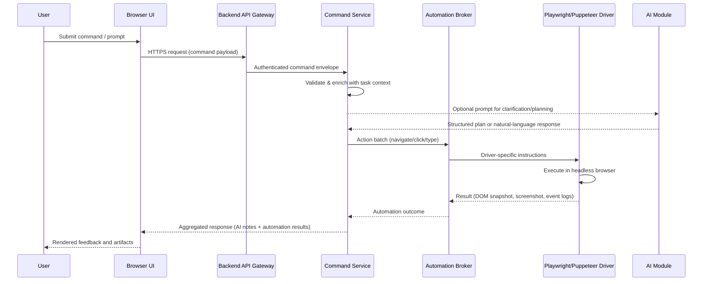

# System Architecture Overview

This document outlines how the UI, backend services, browser automation layer, and AI module collaborate to execute user commands.

## 1. Component Responsibilities

The diagram below highlights the boundaries between the browser-based frontend and the backend services, including the automation driver (e.g., Playwright/Puppeteer) and the AI module.

```mermaid
graph TD
    subgraph Browser / Frontend
        UI[Web UI]
        UI -->|Commands, prompts| APIClient
        APIClient -->|HTTP(S) requests| Network
    end

    subgraph Backend
        Network --> APIGateway
        APIGateway -->|REST/GraphQL| CommandSvc
        CommandSvc -->|Task context| StateStore[(Task Store)]
        CommandSvc -->|Exec requests| AutomationBroker
        CommandSvc -->|AI prompts| AIModule

        subgraph Automation Layer
            AutomationBroker --> PlaywrightDriver[(Playwright/Puppeteer Driver)]
            PlaywrightDriver -->|WebSocket control| HeadlessBrowser[(Headless Browser)]
        end

        subgraph AI Layer
            AIModule -->|API call| ExternalAI[(External API)]
            AIModule -->|gRPC/WebSocket| LocalModel[(Local Model Server)]
        end
    end
```

### Frontend
- Collects user commands/prompts and displays execution feedback.
- Sends structured requests (JSON over HTTPS) to the backend API client.

### Backend Core Services
- **API Gateway**: Authenticates requests and routes them to service handlers.
- **Command Service**: Orchestrates command execution, maintains task context, and issues work to automation and AI subsystems.
- **State Store**: Persists task metadata, command history, and artifacts referenced by the UI.

### Automation Layer
- **Automation Broker**: Normalizes requests (navigate, click, type, wait, screenshot) into driver-friendly actions.
- **Playwright/Puppeteer Driver**: Translates actions into browser automation steps executed inside a headless browser instance.

### AI Layer
- **AI Module**: Provides natural-language understanding and reasoning. It can connect to:
  - **External API** (e.g., OpenAI, Anthropic) using HTTPS.
  - **Local Model Server** via gRPC/WebSocket for low-latency or air-gapped deployments.

## 2. Command Propagation Lifecycle

The sequence diagram shows how a single command moves from the UI through the backend to the browser agent and AI module.



## 3. AI Integration Options

| Deployment | Connection | Use Cases |
|------------|------------|-----------|
| **External API** | HTTPS request signed with API key | Access to managed frontier models without hosting costs. |
| **Local Model Server** | gRPC/WebSocket over internal network | On-prem deployments, data locality, reduced latency. |

Regardless of deployment, the AI module exposes a consistent interface to the Command Service, returning structured plans, tool calls, or plain-language responses.

## 4. Operational Notes

1. **Error Handling**: Automation errors (timeouts, selector issues) are surfaced to the Command Service, which may consult the AI module for remediation steps.
2. **Observability**: Logs from the automation driver and AI module are correlated using a shared command identifier, enabling end-to-end tracing from UI to backend components.
3. **Security**: Credentials for the AI API and browser sessions are stored in the backend's secure secret manager; the frontend never sees them.

This architecture ensures that the UI remains thin while the backend orchestrates both deterministic automation and AI-driven reasoning.
